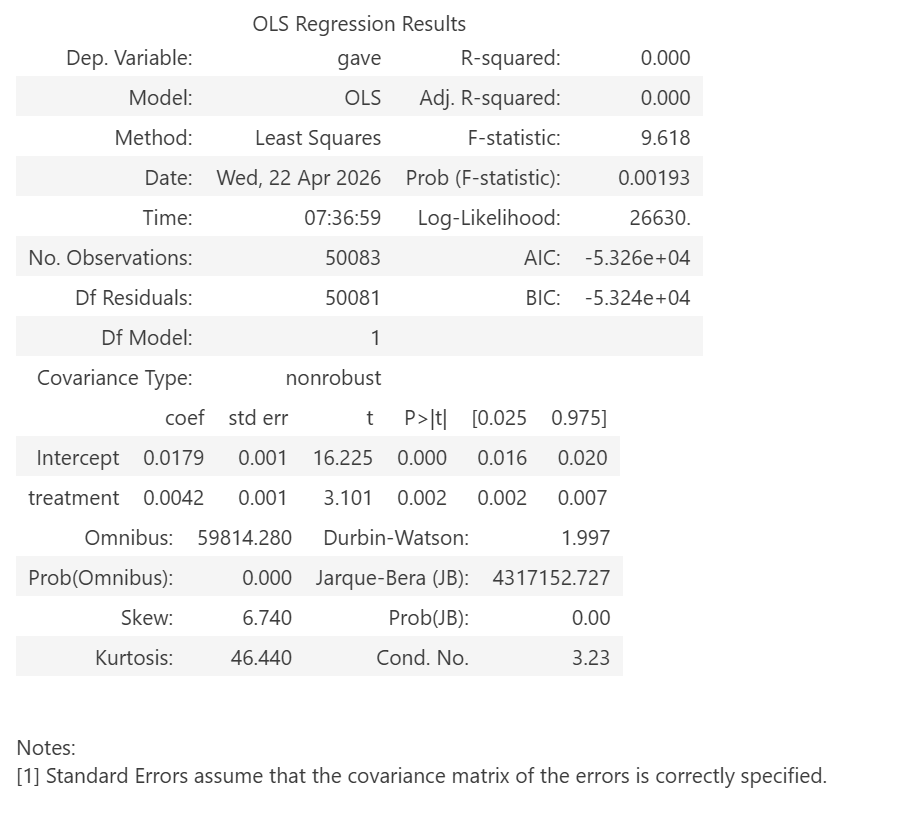
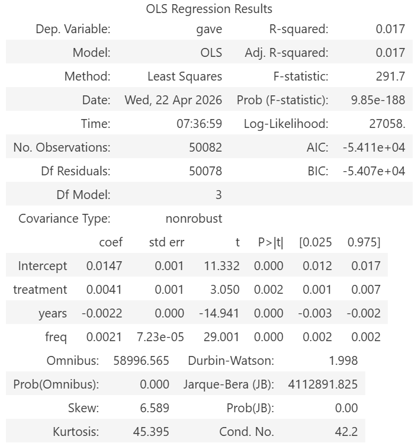

```{python}
#| echo: false
# 初始化数据（隐藏代码，让页面更干净）
import pandas as pd
import statsmodels.formula.api as smf

df = pd.read_stata("AERtables1-5.dta")
```

## Introduction

This paper studies whether financial incentives, such as matching donations, can increase charitable giving. Karlan and List (2007) conduct a large-scale field experiment in which potential donors are randomly assigned to receive or not receive a matching grant offer.

Because the assignment to treatment and control groups is random, any difference in donation behavior between the two groups can be interpreted as a causal effect of the matching incentive. This paper is important because it provides evidence on how nonprofits can design more effective fundraising strategies.

## Main Analysis

### Balance Check (Table 1)

The comparison of baseline characteristics between the treatment and control groups shows that they are very similar. For example, the average number of prior donation years is approximately 6.14 for the control group and 6.08 for the treatment group. This suggests that randomization was successful and there is no evidence of selection bias.
```{python}
#| echo: true
df.groupby('treatment')[['years', 'freq']].mean().round(2)
```


### Effect of Treatment on Giving (Table 2A)

The regression results show that the treatment variable has a positive and statistically significant effect on donation behavior. The coefficient on treatment is 0.0042, indicating that individuals in the treatment group are approximately 0.42 percentage points more likely to donate compared to those in the control group. This effect is statistically significant (p < 0.01), suggesting that matching donations increase the likelihood of giving.

```{python}
#| echo: true
model = smf.ols('gave ~ treatment', data=df).fit()
model.summary()
```



### Regression with Controls (Table 3)

After including control variables such as prior donation history (years) and donation frequency (freq), the estimated treatment effect remains positive and statistically significant. The coefficient on treatment is 0.0041, which is very similar to the baseline estimate. This suggests that the treatment effect is robust and not driven by pre-existing differences between individuals.

```{python}
#| echo: true
model2 = smf.ols('gave ~ treatment + years + freq', data=df).fit()
model2.summary()
```



## Something Additional

### Additional Analysis

The magnitude of the treatment effect is relatively small. While the matching incentive increases the probability of donating, the overall effect size is modest. This suggests that although matching grants are effective, they may not lead to large changes in donor behavior. This highlights the importance of considering both statistical significance and economic significance when evaluating policy interventions.
