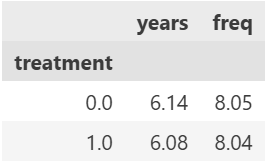

```{python}
#| echo: false
# 初始化数据（隐藏代码，让页面更干净）
import pandas as pd
import statsmodels.formula.api as smf

df = pd.read_stata("AERtables1-5.dta")
```

## Introduction

This paper studies whether financial incentives, such as matching donations, can increase charitable giving. Karlan and List (2007) conduct a large-scale field experiment in which potential donors are randomly assigned to receive or not receive a matching grant offer.

Because the assignment to treatment and control groups is random, any difference in donation behavior between the two groups can be interpreted as a causal effect of the matching incentive. This paper is important because it provides evidence on how nonprofits can design more effective fundraising strategies.

This replication first checks whether the treatment and control groups look similar before the experiment. It then estimates the effect of receiving a matching grant offer on the probability of giving, first without controls and then with controls for prior donation history. The final section discusses why the result is statistically significant but economically modest.

## Main Analysis

### Balance Check (Table 1)

The comparison of baseline characteristics between the treatment and control groups shows that they are very similar. For example, the average number of prior donation years is approximately 6.14 for the control group and 6.08 for the treatment group. This suggests that randomization was successful and there is no evidence of selection bias.

```{python}
#| echo: true
df.groupby('treatment')[['years', 'freq']].mean().round(2)
```



### Effect of Treatment on Giving (Table 2A)

The regression results show that the treatment variable has a positive and statistically significant effect on donation behavior. The coefficient on treatment is 0.0042, indicating that individuals in the treatment group are approximately 0.42 percentage points more likely to donate compared to those in the control group. This effect is statistically significant (p < 0.01), suggesting that matching donations increase the likelihood of giving.

```{python}
#| echo: true
model = smf.ols('gave ~ treatment', data=df).fit()
model.summary()
```


### Regression with Controls (Table 3)

After including control variables such as prior donation history (years) and donation frequency (freq), the estimated treatment effect remains positive and statistically significant. The coefficient on treatment is 0.0041, which is very similar to the baseline estimate. This suggests that the treatment effect is robust and not driven by pre-existing differences between individuals.

```{python}
#| echo: true
model2 = smf.ols('gave ~ treatment + years + freq', data=df).fit()
model2.summary()
```


## Something Additional

### Statistical Significance vs. Economic Significance

One useful way to interpret the treatment effect is to separate statistical significance from economic significance. The regression results suggest that the matching grant offer has a statistically significant effect on whether someone gives. However, the estimated increase in giving is only about 0.4 percentage points, which is small in practical terms.

This means that matching grants can help increase participation, but they may not dramatically change donor behavior on their own. For nonprofit organizations, the result suggests that matching campaigns should be evaluated not only by whether they increase donations, but also by whether the additional donations are large enough to justify the cost of securing and advertising the match.

## Conclusion

Overall, this replication supports the main finding of Karlan and List (2007): matching grant offers can increase the likelihood of charitable giving. The balance check supports the validity of the randomized design, and the regression results remain stable after adding controls for prior donation behavior. However, the small size of the estimated effect shows that statistical significance does not always imply a large practical impact. This distinction is important for nonprofits when deciding whether matching grant campaigns are worth implementing.
