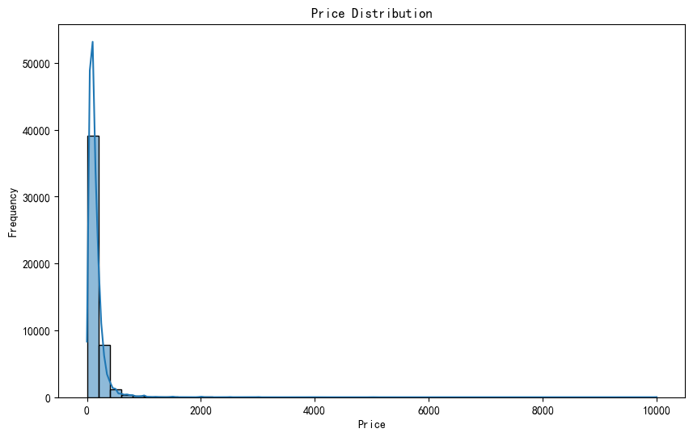
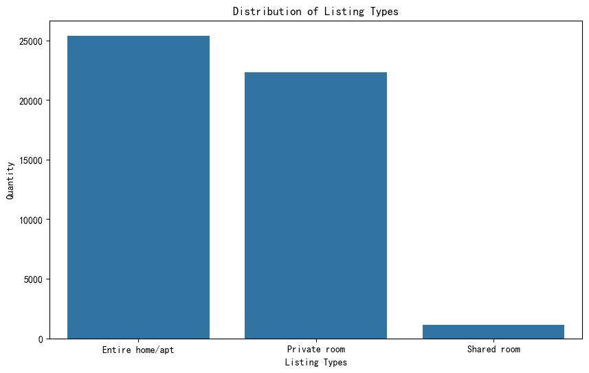
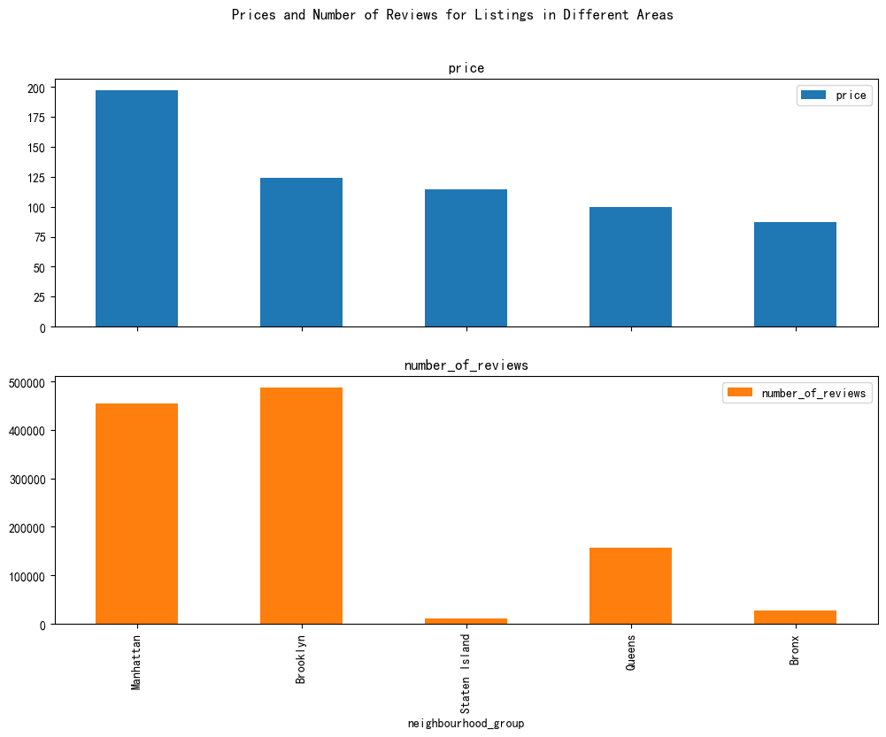

##  Project Overview

This project analyzes transportation and housing-related data to understand patterns in trip duration, service usage, and housing preferences.

---

##  Key Questions

- How does trip duration vary across service providers?
- What factors influence average trip distance?
- How do housing types differ in usage patterns?

---

##  Data & Methods

- Data cleaning using Python (pandas)
- Exploratory Data Analysis (EDA)
- Visualization using matplotlib

---

##  Key Visualizations

### Price Distribution

The distribution of listing prices is highly right-skewed, indicating that while most listings are affordable, a small number of listings have extremely high prices.

---

### Listing Type Distribution

Entire homes/apartments dominate the market, followed by private rooms, while shared rooms represent only a small portion of listings.

---

### Price and Reviews by Area

Manhattan has the highest average prices, while Brooklyn and Queens attract a large number of reviews, indicating strong demand in these areas.

---

##  Key Insights

- Trip duration varies significantly across providers
- Customer behavior differs by service type
- Housing preferences vary across user groups

---

##  Full Project

For full analysis and code, please download the notebook:

[Download Notebook](../../files/analysis.ipynb)
