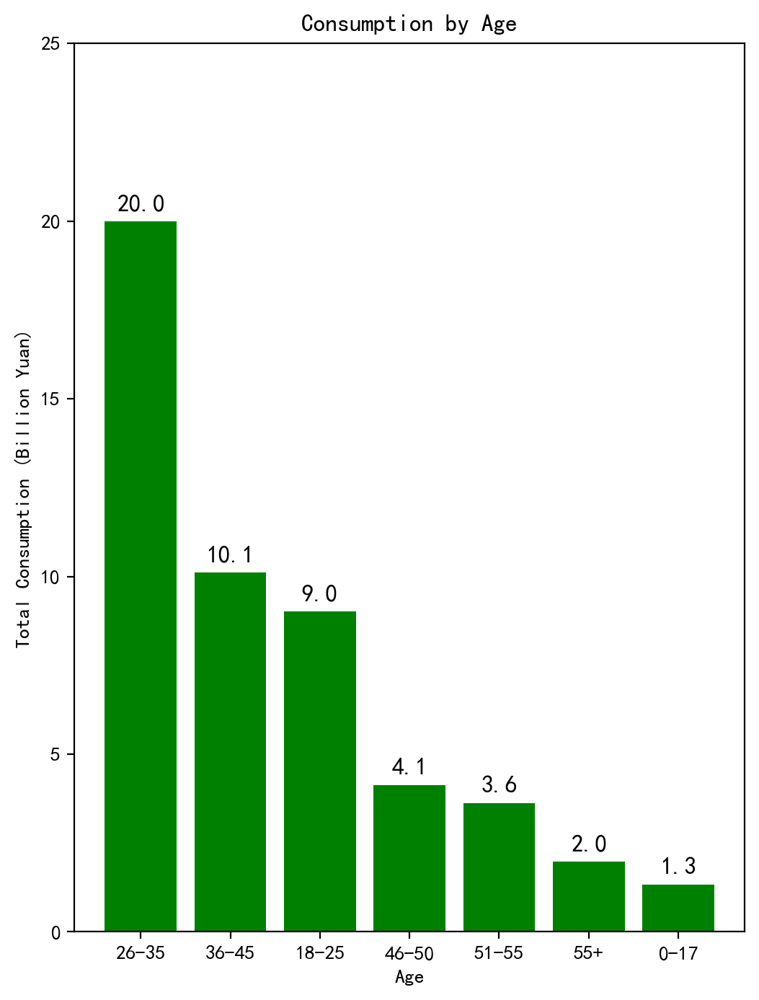
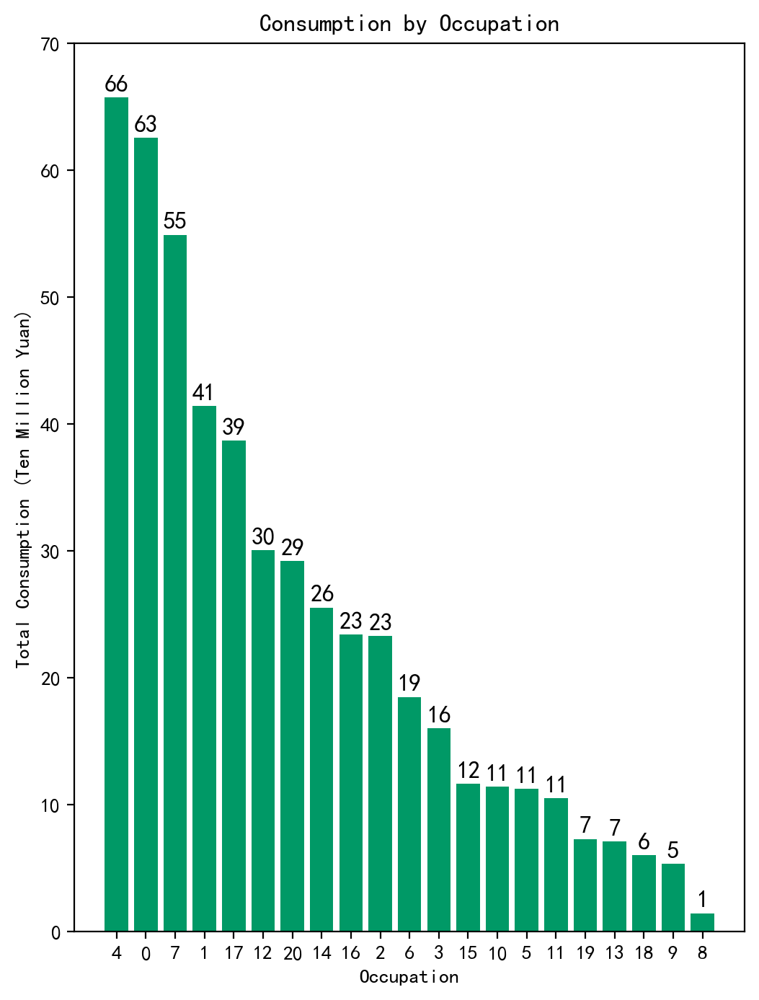
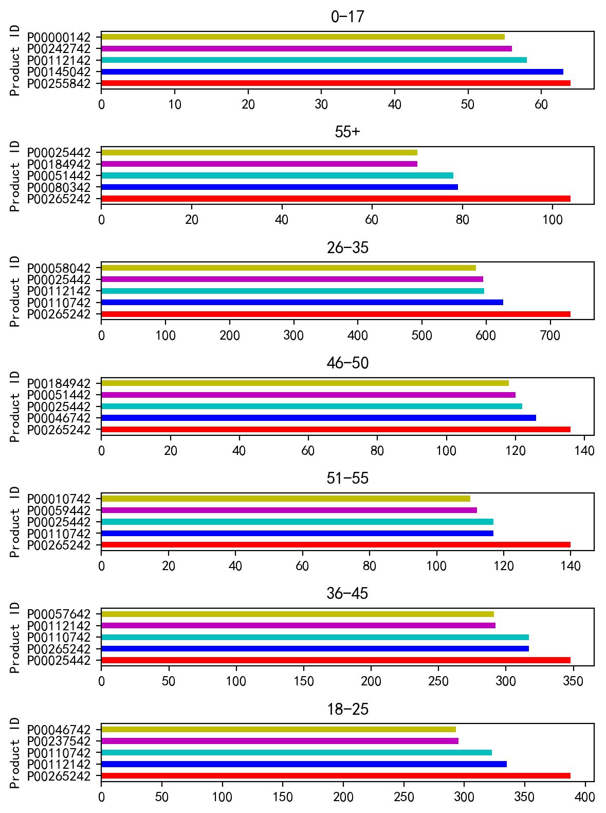

##  Project Overview

This project analyzes customer purchase behavior during Black Friday using transaction data. The goal is to understand how different demographic factors influence spending patterns.

---

##  Key Questions

- Which age group spends the most?
- How does occupation affect purchasing behavior?
- Do different age groups prefer different products?

---

##  Data & Methods

- Data cleaning using Python (pandas)
- Exploratory Data Analysis (EDA)
- Visualization using matplotlib

---

##  Key Visualizations

### Spending by Age

Customers aged **26–35** contribute the highest total spending, making them the most valuable customer segment.

---

### Spending by Occupation

Spending varies significantly across occupations, suggesting income level and job type influence purchasing behavior.

---

### Product Preferences by Age Group

Different age groups show distinct preferences for product categories, indicating opportunities for targeted marketing strategies.

---

##  Key Insights

- The **26–35 age group** is the primary contributor to total sales
- Consumer behavior varies significantly by **occupation**
- Product preferences differ across **age segments**

---

## 📎 Full Project

For full analysis and code, please download the notebook:

[Download Notebook](../../files/BlackFriday-checkpoint.ipynb)
