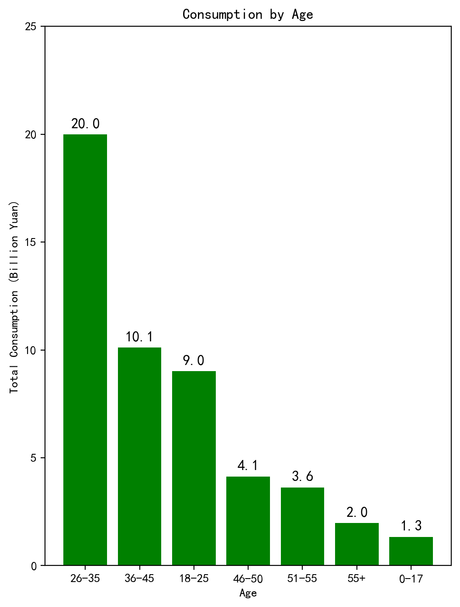
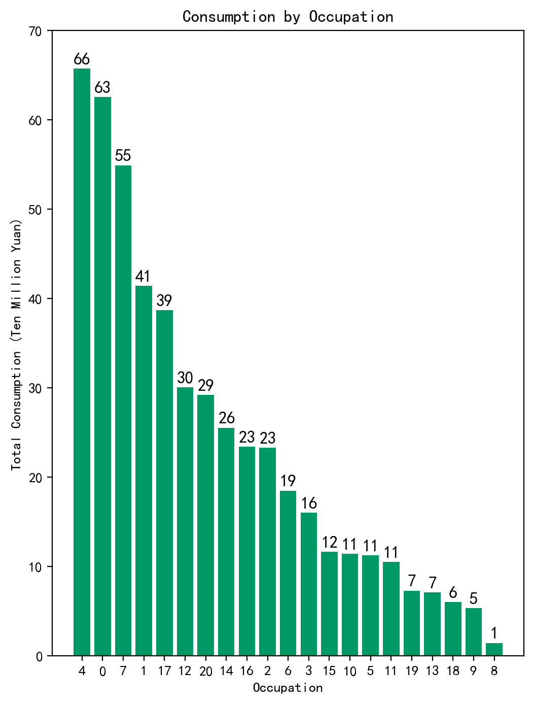
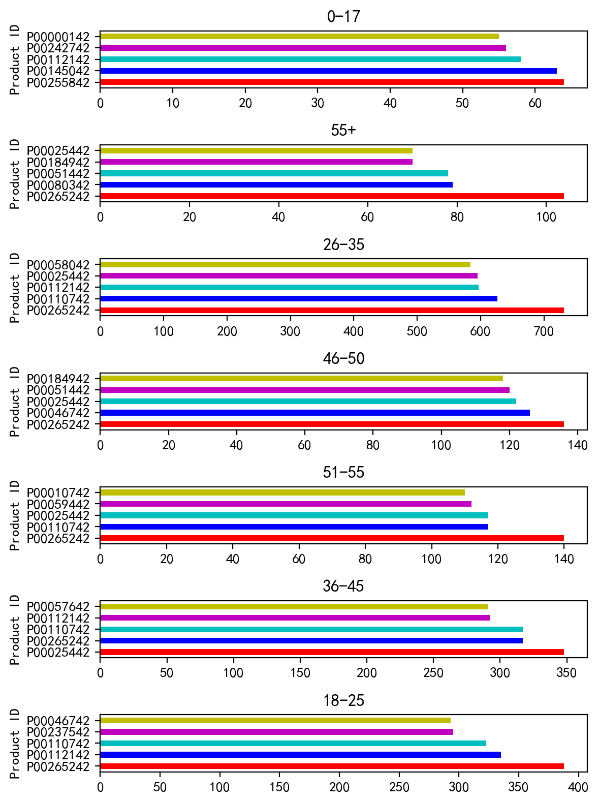

## Project Overview

This project analyzes customer purchase behavior during Black Friday using transaction data from a large retail dataset. The goal is to understand how different demographic factors such as age, gender, and occupation influence spending patterns.

---

## Key Questions

- Which age group spends the most?
- How does occupation affect purchasing behavior?
- Do different age groups prefer different products?
- Does gender play a role in spending amount?

---

## Data & Methods

- Data cleaning and preprocessing using Python (pandas)
- Exploratory Data Analysis (EDA) to identify trends and patterns
- Visualization using matplotlib and seaborn
- Groupby aggregations to compare spending across demographic segments

---

## Key Visualizations

### Spending by Age

Customers aged **26–35** contribute the highest total spending, making them the most valuable customer segment. This group likely represents working adults with higher disposable income.

---

### Spending by Occupation

Spending varies significantly across occupations, suggesting that income level and job type influence purchasing behavior. Certain occupations show notably higher average transaction values.

---

### Product Preferences by Age Group

Different age groups show distinct preferences for product categories, indicating opportunities for targeted marketing strategies tailored to each segment.

---

## Key Insights

- The **26–35 age group** is the primary contributor to total sales, accounting for the largest share of Black Friday transactions
- Consumer behavior varies significantly by **occupation**, with some job categories spending nearly twice the average
- Product preferences differ across **age segments**, suggesting retailers can improve conversion rates through personalized recommendations

---

## 🔗 Full Project

For full analysis and code, please download the notebook:

[Download Notebook](../../files/BlackFriday-checkpoint.ipynb)
